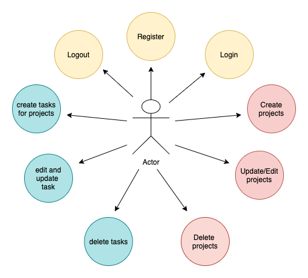

# sernTask
### sernTask is an application to easily manage projects and personal tasks. A little help to make your life easier!!!

### Use Cases

### Work Flow

## Technical Description

### Blocks

## Code Coverage

### Server Side 

### Data Model

## Technologies

JavaScript, ReactJS, Node.js, Express, MongoDB, Mongoose. Testing: Jest & Mocha/Chai

## TO DO

- Testing in serntask-cliente in process.
